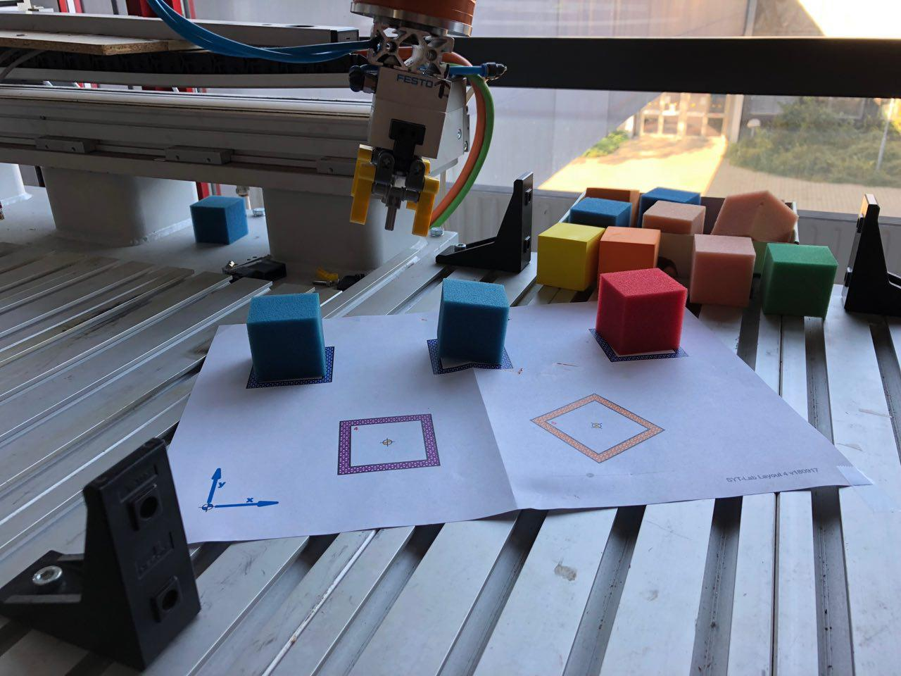
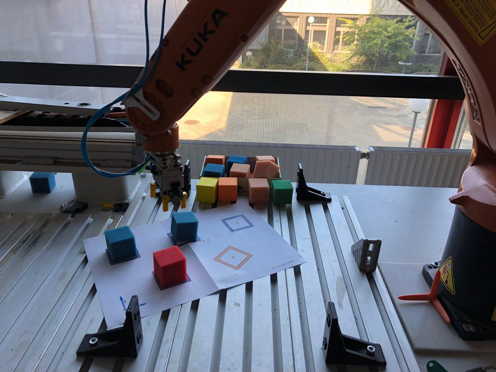

 
 
 

Systemtechnik Labor 
4CHIT 2018/19, Gruppe 1 
# Roboterbedienung und Koordinatensysteme 

Jordi Rieder 4CHIT 
14.10.2018 
 
Betreuerin: Jennifer Janik


\Seitenumbruch
<!-- Eigentlicher Kontent -->
## 1 Einführung
Das Ziel dieser Laborübung ist es erste Erfahrungen mit dem Industrieroboter der Firma Kuka zu sammeln, im speziellen mit der Handsteuerung des Roboters.
### 1.1 Ziele
1. Du kannst die Roboter grundlegend in Betrieb nehmen und einfache Meldungen des Systems bearbeiten. Du kannst alle Achsen des Roboters benennen und per Handbediengerät bewegen. Du kennst die Bewegungseinschränkungen und Limits aller Achsen. Du kannst den TCP gezielt an einen Punkt im Raum steuern.
2. Du kennst die verschiedenen Koordinatensysteme, die bei Roboterbewegungen eingesetzt werden, und die Gründe dafür. Du kannst eigene Werkzeug- und Basis-Koordinatensysteme definieren und bei Roboterbewegungen sinnvoll einsetzen.
### 1.2 Vorraussetzungen 
Bevor man die Übung durchführt ist es wichtig die Sicherheitsbestimmungen bzw. die Regeln für den Umgang mit dem Roboter zu verstehen. Daher haben wir eine Umfassende Einführung von der Frau. Prof Janik erhalten.
## 2 Aufgabenstellung
### 2.1 Teil 1
1. Rüste den Roboter mit dem Parallelbackengreifer aus (falls noch nötig).
2. Mache dich mit den Achsbewegungen vertraut. Steuere dazu jede Achse einzeln an und danach auch in Kombination. Verwende dazu verschiedene Geschwindigkeiten.
3. Stelle die Handsteuerung auf das Weltkoordinatensystem um. Verfahre den Roboter im Weltkoordinatensystem unterer Benutzung der Tasten und des 6-Achsen-Joysticks. Was hat sich dadurch verändert?
4. Befestige die Schablone "Layout 4" im Arbeitsbereich des Roboters und platziere einen Würfel.
5. Steuere den Roboter zu einem Würfel und schließe den Greifer. Setze den Würfel auf einer beliebigen Stelle innerhalb des Arbeitsraumes ab.
6. Setze 3 Würfel auf die Plätzen 1, 2 und 3. Anschließend setze mithilfe des Roboters die Würfel folgendermaßen um:  Schüler 3: 3-->4, 2-->5, 1-->5   (Würfel 2 horizonal greifen) 
Welche Schwierigkeiten ergaben sich? Erstelle ein Flussdiagramm dieser Übung und arbeite es in dein Laborprotokoll ein.

### 2.2 Teil 2
1. Vermesse den Parallelbackengreifer und speichere die Konfiguration unter Werkzeug Nummer 4. 
Werkzeuggewicht: 0,5kg, alle anderen Werkzeug-Parameter können auf 0 belassen werden. Dabei sollte eine Genauigkeit von unter 1,5mm erreicht werden.
2. Fahre nun hintereinander mit der Handsteuerung die Punkte 1, 2 und 3 an.
3.Vermesse die durch das blaue Koordinatenkreuz gegebene Basis und speichere die Konfiguration unter Basis Nummer 4.
4. Welche Verbesserungen ergeben sich durch Benutzung des Basiskoordinantensystems beim Umsetzen der Würfel?
## 3 Durchführung
Da der Parallelbackengreifer bereits montiert war konnte ich mir diesen Schritt ersparen und habe lediglich die Steuerung auf Weltkoordinatensystem umgestellt da diese besser für diese Übung geeignet ist. Da ich Schüler 3 war habe ich folgende folgende Übung durchgeführt: 
 

 
**Ausgangsposition** 
 
**Den Würfel von Position 3 auf Position 4 verschieben** 
 
**Den Würfel von Position 2 auf Position 5 verschieben, jedoch mit horizontalen Griff** 
 
**Den Würfel von Position 1 auf Position 5 verschieben** 





